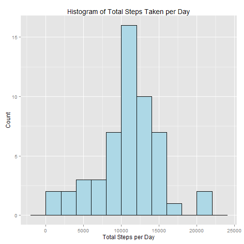
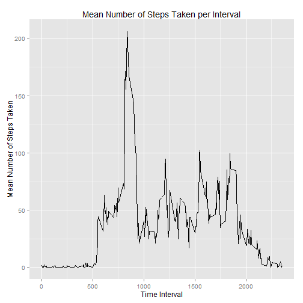
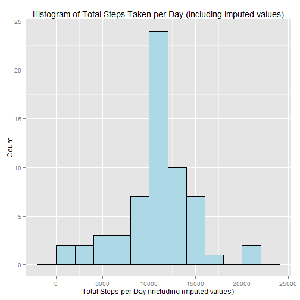
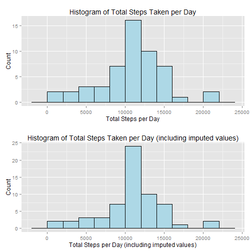
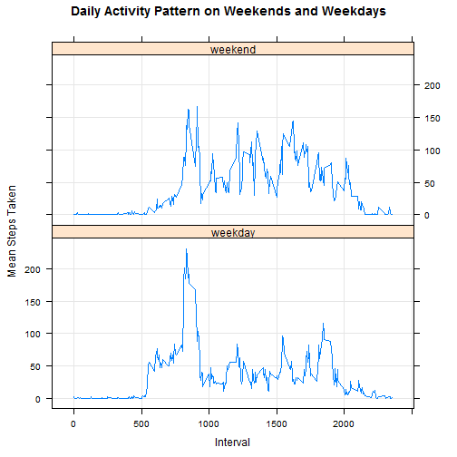

Reproducible Research: Peer Assessment 1
==========================================
## Introduction
This assignment makes use of data from a personal activity monitoring device. This device collects data at 5 minute intervals through out the day. The data consists of two months of data from an anonymous individual collected during the months of October and November, 2012 and include the number of steps taken in 5 minute intervals each day.

## Manual Inspection of the Data
A manual inspection of file activity.csv using a text editor and Excel confirms that it is in csv format, includes a header and is reasonably tidy. Although, there are a significant number of NA values in the "steps" column.

The data file contains 17,568 rows of data and 3 columns. The column headers are "steps", "date" and "interval". The date format is yyyy-mm-dd. These details are in agreement with the assignment description.

It appears as though there are a number of days for which measurements were not available. That is the "interval" column contains NA values for the entire day. When "interval" contains NA we do not know how many steps were taken in that interval. We can not assume it was zero steps and have to be mindful of this when doing the analysis.

## Loading the Data
The data is initially loaded into a data frame named "rawData" using the read.csv() method. We do not want columns loaded as factors. The remaining default argument values for function read.csv are appropriate.


```r
# Load the raw data into a data frame
rawData <- read.csv("activity.csv", stringsAsFactors=FALSE)

# check that the expected number of rows were loaded
nrow(rawData)
```

```
## [1] 17568
```

Data frame "rawData"" contains 17,568 rows of data as expected. Next we will use the str() function to inspect the classes of the data frame columns before processing the data in preparation for analysis.


```r
# Take a look at the structure of the data frame
str(rawData)
```

```
## 'data.frame':	17568 obs. of  3 variables:
##  $ steps   : int  NA NA NA NA NA NA NA NA NA NA ...
##  $ date    : chr  "2012-10-01" "2012-10-01" "2012-10-01" "2012-10-01" ...
##  $ interval: int  0 5 10 15 20 25 30 35 40 45 ...
```

The "steps" and "interval" values have been read in as integers and the "date" values as characters.

## Preprocessing the Data
For the initial analysis we want to remove rows containing NA values as these would result in incorrect means etc. if included as zeros in the calculations.

The rows from the raw data that do not contain NA values are assigned to a new data frame named "cleanData".


```r
cleanData <- rawData[complete.cases(rawData), ]
```

Data frame "cleanData" now contains no rows with NA values in any of the columns.


```r
# Take a look at the first 6 rows of data frame cleanData
head(cleanData)
```

```
##     steps       date interval
## 289     0 2012-10-02        0
## 290     0 2012-10-02        5
## 291     0 2012-10-02       10
## 292     0 2012-10-02       15
## 293     0 2012-10-02       20
## 294     0 2012-10-02       25
```

## Total Number of Steps Taken per Day
### Computing the Total Number of Steps Taken per Day
The total number of steps per day is computed using the aggregate() function and assigned to the variable stepsPerDay.


```r
# Compute the total number of steps per day and assign meaningful column names
stepsPerDay <- setNames(aggregate(cleanData$steps, by=list(date=cleanData$date), FUN=sum), c("date", "totalsteps"))
```
The resulting data frame "stepsPerDay" contains the date for each day in chronological order along with the total number of steps taken each day.


```r
# Take a look at the first 6 rows of data frame stepsPerDay
head(stepsPerDay)
```

```
##         date totalsteps
## 1 2012-10-02        126
## 2 2012-10-03      11352
## 3 2012-10-04      12116
## 4 2012-10-05      13294
## 5 2012-10-06      15420
## 6 2012-10-07      11015
```

### Histogram of the Total Number of Steps Taken per Day
A histogram of the total number of steps taken per day follows.


```r
# Ensure the ggplot2 library is loaded
library(ggplot2)

# Plot a histogram of the total number of steps taken per day
ggplot(stepsPerDay, aes(x=stepsPerDay$totalsteps)) + geom_histogram(binwidth=2000, colour="black", fill="lightblue", ) + xlab("Total Steps per Day") + ylab("Count") + ggtitle("Histogram of Total Steps Taken per Day")
```

 

### Mean and Median of the Total Number of Steps Taken per Day
The mean number of steps taken per day is computed using the mean() function.


```r
# Compute the mean of the total number of steps taken per day
meanStepsPerDay <- mean(stepsPerDay$totalsteps)
```

The **mean** total number of steps taken per day (rounded to 2 decimal places is:


```r
format(meanStepsPerDay, nsmall=2, big.mark=",")
```

```
## [1] "10,766.19"
```

The median total number of steps taken per day is computed in a similar manner to the mean.


```r
# Compute the median of the total number of steps taken per day
medianStepsPerDay <- median(stepsPerDay$totalsteps)
```

The **median** total number of steps taken per day is:


```r
format(medianStepsPerDay, big.mark=",")
```

```
## [1] "10,765"
```

## Daily Activity Pattern
### Computing the Mean Number of Steps Taken per Interval
To examine the daily activity pattern the mean number of steps taken within each of the 5 min intervals is computed and plotted. Note that we are using the mean() function for the aggregation.


```r
# Compute the mean number of steps per interval and assign meaningful column names
meanStepsPerInterval <- setNames(aggregate(cleanData$steps, by=list(cleanData$interval), FUN=mean), c("interval", "meansteps"))
```

### Time Series Plot of the Mean Number of Steps Taken per Interval
A time series plot of the mean number of steps taken per interval follows.


```r
# Plot the mean number of steps taken per interval
ggplot(meanStepsPerInterval, aes(interval, meansteps)) + geom_line() + xlab("Time Interval") + ylab("Mean Number of Steps Taken") + ggtitle("Mean Number of Steps Taken per Interval")
```

 

Very few steps are taken up to interval 500 when the mean number of steps per interval begins to increase peaking at over 200 steps per interval at interval 835. The mean number of steps taken per interval then drops sharply to 21 steps per interval at time interval 955. The mean steps per interval then varies between approximately 25 to 100 steps up until interval 1845 when it peaks at approximately 99 steps per interval before steadily trending downward reaching near zero around interval 2200. The mean steps per interval then remains near zero for the remaining intervals in the day.

### Interval with Max Average Number of Steps
The 5-minute interval that, on average across all the days in the dataset, contains the maximum number of steps is identified using the which.max() function.


```r
meanStepsPerInterval[which.max(meanStepsPerInterval$meansteps), ]$interval
```

```
## [1] 835
```

The highest average number of steps taken per interval, computed across all days, occurred in interval **835**.

## Imputing Missing Values
### Analyzing NA Values in the Raw Data
Initially we are going to check each of the columns in data frame "rawData" for missing values. This can be done using function ifelse() that builds an interger array containing 1's and 0's. A 1 indicates that a value is missing and zero indicates the value was provided. Summing the array effectively counts the number of missing values for the given column.


```r
sum(ifelse(is.na(rawData$date), 1, 0))
```

```
## [1] 0
```


```r
sum(ifelse(is.na(rawData$interval), 1, 0))
```

```
## [1] 0
```


```r
sum(ifelse(is.na(rawData$steps), 1, 0))
```

```
## [1] 2304
```

Given that the "date" and "interval" columns contain no missing values and that the "steps" column is the only other column, we can conclude that there are **2,304** rows of data that contain missing values / NA values.

We can double check this by subtracting the number of rows in data frame "rawData" that contain no missing values from the total number of rows.


```r
# Compute and display the number of rows in data frame rawData that contain NA values
nrow(rawData) - nrow(rawData[complete.cases(rawData), ])
```

```
## [1] 2304
```

The second method of computing the number of rows that contain missing values confirms that there are 2,304 rows with missing data.

### Strategy for Imputing Missing Values
The strategy employed to impute missing step data is to replace each missing value with the average number of steps taken for the time interval rounded to the nearest whole number.

The result is a new data frame named 'imputedData' containing the "date", "interval" and either the original or imputed number of steps that were taken in that interval.

The ifelse() function is used to find and replace the missing values with the average values for the intervals with no step data.


```r
# Impute missing values by replacing them with the average value for the interval
imputedData <- data.frame(steps = ifelse(is.na(rawData$steps), as.integer(round(meanStepsPerInterval[meanStepsPerInterval$interval %in% rawData$interval, ]$meansteps, 0)), rawData$steps), date=rawData$date, interval=rawData$interval)
```

We can see that missing values have been imputed successfully by examining the first and last 6 rows of data frame 'imputedData' that originally contained missing values.


```r
# Take a look at the first 6 rows of data frame imputedData
head(imputedData)
```

```
##   steps       date interval
## 1     2 2012-10-01        0
## 2     0 2012-10-01        5
## 3     0 2012-10-01       10
## 4     0 2012-10-01       15
## 5     0 2012-10-01       20
## 6     2 2012-10-01       25
```


```r
# Take a look at the last 6 rows of data frame imputedData
tail(imputedData)
```

```
##       steps       date interval
## 17563     3 2012-11-30     2330
## 17564     5 2012-11-30     2335
## 17565     3 2012-11-30     2340
## 17566     1 2012-11-30     2345
## 17567     0 2012-11-30     2350
## 17568     1 2012-11-30     2355
```

The raw data file contained no step data for October 1st. The missing step data has been replaced with the imputed average number of steps taken for the respective intervals.

A final check for missing values is done by computing the number of rows in data frame "imputedData" that contain missing values.


```r
# Compute and display the number of rows in data frame imputedData that contain NA values
nrow(imputedData) - nrow(imputedData[complete.cases(imputedData), ])
```

```
## [1] 0
```

No rows in data frame "imputedData" contain missing values.

## Total Number of Steps Taken per Day (including imputed values)
### Computing the Total Number of Steps Taken per Day (including imputed values)
The total number of steps per day is computed using the aggregate() function with the imputed data and assigned to the variable imputedStepsPerDay.


```r
# Compute the total number of steps per day and assign meaningful column names
imputedStepsPerDay <- setNames(aggregate(imputedData$steps, by=list(date=imputedData$date), FUN=sum), c("date", "totalsteps"))
```
The resulting data frame "imputedStepsPerDay" contains the date for each day in chronological order along with the total number of steps taken each day that inludes imputed values.


```r
head(imputedStepsPerDay)
```

```
##         date totalsteps
## 1 2012-10-01      10762
## 2 2012-10-02        126
## 3 2012-10-03      11352
## 4 2012-10-04      12116
## 5 2012-10-05      13294
## 6 2012-10-06      15420
```

### Histogram of the Total Number of Steps Taken per Day (including imputed values)

A histogram of the total number of steps taken per day including imputed steps per day follows.


```r
# Plot a histogram of the total number of steps taken per day including the imputed data
ggplot(imputedStepsPerDay, aes(x=imputedStepsPerDay$totalsteps)) + geom_histogram(binwidth=2000, colour="black", fill="lightblue", ) + xlab("Total Steps per Day (including imputed values)") + ylab("Count") + ggtitle("Histogram of Total Steps Taken per Day (including imputed values)")
```

 

### Mean and Median of the Total Number of Steps Taken per Day (including imputed values)
The mean number of steps taken per day is computed using the mean() function and data frame "imputedStepsPerDay" to include the imputed data.


```r
# Compute the mean of the total number of steps taken per day including imputed values
imputedMeanStepsPerDay <- mean(imputedStepsPerDay$totalsteps)
```

The **mean** total number of steps taken per day, **including imputed values** and (rounded to 2 decimal places is:


```r
format(imputedMeanStepsPerDay, nsmall=2, big.mark=",")
```

```
## [1] "10,765.64"
```

The **mean** total number of steps taken per day, **excluding NA values** and rounded to 2 decimal places is:


```r
format(meanStepsPerDay, nsmall=2, big.mark=",")
```

```
## [1] "10,766.19"
```

The mean number of steps taken per day when including imputed values is slightly lower than the mean number of steps taken per day when excluding all NA values. The means would have been identical if we had not rounded the imputed number of steps to the nearest whole number.

The median total number of steps taken per day, **including imputed values**, is computed in a similar manner to the mean.


```r
# Compute the median of the total number of steps taken per day
imputedMedianStepsPerDay <- median(imputedStepsPerDay$totalsteps)
```

The **median** total number of steps taken per day, **including imputed values**, is:


```r
format(imputedMedianStepsPerDay, big.mark=",")
```

```
## [1] "10,762"
```

The **median** total number of steps taken per day, **excluding NA values** and rounded to 2 decimal places is:


```r
format(medianStepsPerDay, nsmall=2, big.mark=",")
```

```
## [1] "10,765"
```

The **median** number of steps taken per day when **including imputed values** is slightly lower than the median number of steps taken per day when **excluding all NA values**.

### Impact of Imputing Missing Data on the Estimates of the Total Daily Number of Steps

The impact of imputing missing data on the mean and median number of steps taken per day has been investigated in the prior section.

To further investigate the impact of imputing missing data on the estimates of the total daily number of steps we will compare the histograms of the total steps taken per day.


```r
# Ensure the grid package is loaded
library(grid)

# Histogram of the total number of steps taken per day
p1 <- ggplot(stepsPerDay, aes(x=stepsPerDay$totalsteps)) + geom_histogram(binwidth=2000, colour="black", fill="lightblue", ) + xlab("Total Steps per Day") + ylab("Count") + ggtitle("Histogram of Total Steps Taken per Day")

# Histogram of the total number of steps taken per day including the imputed data
p2 <- ggplot(imputedStepsPerDay, aes(x=imputedStepsPerDay$totalsteps)) + geom_histogram(binwidth=2000, colour="black", fill="lightblue", ) + xlab("Total Steps per Day (including imputed values)") + ylab("Count") + ggtitle("Histogram of Total Steps Taken per Day (including imputed values)")

# Define grid layout to locate plots and print each graph
pushViewport(viewport(layout = grid.layout(2, 1)))
print(p1, vp = viewport(layout.pos.row = 1, layout.pos.col = 1))
print(p2, vp = viewport(layout.pos.row = 2, layout.pos.col = 1))
```

 

The overall shapes of the two historgrams are basically identical. The difference is that the counts of the total steps taken per day are approximately 50% higher for the data that includes imputed values. This is to be expected because we increased the amount of step data by imputing missing values. The basic shapes of the histograms are nearly identical because of the strategy that was used to impute the missing values (inserting the mean steps for the given time interval).

## Differences in Activity Patterns between Weekdays and Weekends
The data that includes imputed missing step values will be used to compare the activity patterns on weekdays versus weekends.

### Factor Variable to Indicate if Date Falls on a Weekday or Weekend
To enable the comparison of weekday and weekend activity patterns a factor variable is created that will equal "weekday" if the date occurs from Monday through to Friday and "weekend" if the date falls on a Saturday or Sunday.


```r
# Append a factor variable indicating if the date falls on a weekday or weekend to the data frame with the imputed missing values
imputedData$daytype <- as.factor(ifelse(weekdays(as.Date(imputedData$date)) %in% c('Saturday','Sunday'), "weekend", "weekday"))
```
The new column is named "daytype".

### Computing the Mean Number of Steps Taken per Interval for each Day Type
To examine the daily activity pattern the mean number of steps taken within each of the 5 min intervals for weekdays and weekends is computed. Note that we are using the mean() function for the aggregation and aggregating by columns "interval" and "daytype".


```r
# Compute the mean number of steps per interval and day type and assign meaningful column names
meanStepsPerIntervalDaytype <- setNames(aggregate(imputedData$steps, by=list(imputedData$interval, imputedData$daytype), FUN=mean), c("interval", "daytype", "meansteps"))
```

### Plotting the Daily Activity Pattern on Weekdays and Weekends


```r
# Ensure the lattice library is loaded
library(lattice)

# Plot the mean steps taken at each time interval on weekends and weekdays
xyplot(meansteps ~ interval | daytype, data=meanStepsPerIntervalDaytype, type=c("l", "g"), layout=c(1, 2), xlab="Interval", ylab="Mean Steps Taken", main="Daily Activity Pattern on Weekends and Weekdays")
```

 
### Comparing the Daily Activity Patterns on Weekdays and Weekends
The peak number of steps per interval occurs around the same time on weekends and weekdays, however, the max steps taken per interval is significantly higher on weekdays (about 240 on weekdays and about 170 on weekends).

Both plots show that the average steps per interval delcines to approximately 15 steps per interval after the peak. The low following the peak occurs at approximately interval 900 on the weekend and at approximately interval 1,100 on weekdays. 

From about interval 1,000 through to approximately 2,000 more steps are taken on average on the weekends.
